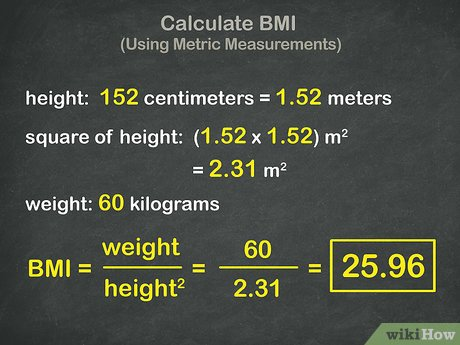

# BMI Calculator

## Project Details

- **Name:** BMI Calculator  
- **Year:** 2025  
- **Category:** JavaScript  
- **Type:** Functions & State  

## Description
Compute BMI from height and weight inputs and display the corresponding category with validation.

## Full Description
The **BMI Calculator** is a JavaScript application that enables users to calculate their **Body Mass Index (BMI)** by entering height and weight. It determines the BMI value and categorizes the result (e.g., underweight, normal, overweight, obese).  
The project demonstrates knowledge of **functions, state management, and controlled inputs**, while also including basic **validation** for user-friendly and reliable results.

## Overview
An interactive tool that computes BMI from user inputs and shows the corresponding health category.

### Features
- Takes height and weight as controlled inputs  
- Calculates BMI and displays the category  
- Includes basic validation for input accuracy  

## BMI Categories
According to the **World Health Organization (WHO):**

- **Underweight:** BMI < 18.5  
- **Normal weight:** 18.5 ≤ BMI < 24.9  
- **Overweight:** 25 ≤ BMI < 29.9  
- **Obese:** BMI ≥ 30  

## Links
- **Live Demo:** [BMI Calculator](https://bmi-calculator-five-chi.vercel.app/)  
- **Repository:** [GitHub Repo](https://github.com/samuel12-dot/bmi-calculator.git)  
